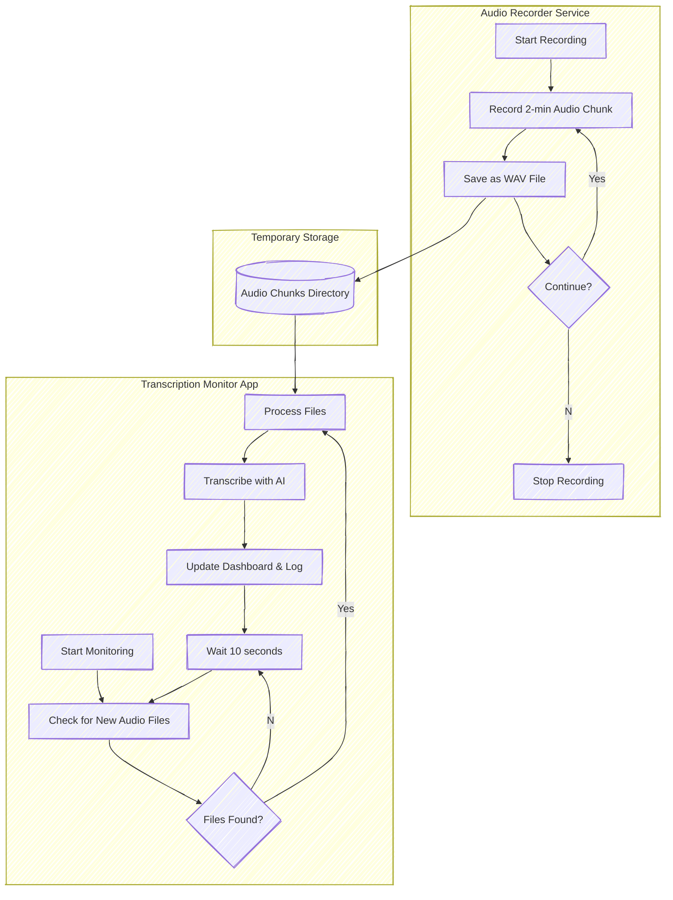

# Continuous Audio Recording and Transcription System

This system provides continuous audio recording and real-time transcription capabilities. It consists of two primary components that work seamlessly together:

1. Audio Recorder: A background service that continuously records audio in fixed-duration chunks (currently 2 minutes) and saves them to a designated directory.
2. Transcription Monitor: A web application that monitors the audio files, transcribes them using AI, displays transcriptions in real-time, and logs them with timestamps.

## Component Details 

1. Audio Recorder

Purpose: Continuously record audio in the background and save it as audio files.

Key Features:

* Records audio in fixed-duration chunks (configurable, currently set to 300 seconds)
* Generates uniquely named audio files with timestamps
* Runs quietly in the background until manually stopped

Configuration Options:

* Duration of each audio chunk in seconds (default: 300)
* Audio quality settings (currently optimised for speech)
* Storage location for audio chunks

2. Transcription Monitor

Purpose: Process audio files, transcribe them, and display results in a web interface.

Key Features:

* Web-based monitoring dashboard
* Automatic detection of new audio recordings
* Transcription using advanced AI technology
* Real-time display of transcription results
* Persistent logging with timestamps
* Simple start/stop controls for monitoring process

Configuration Options:

* Directory to monitor for audio files
* Polling interval for checking new files (default: 10 seconds)
* Transcription log file format and location
* AI model size (adjustable for accuracy vs speed trade-offs)

## System Orchestration

The two components work independently but are designed to integrate seamlessly:

1. Data Flow:
  * The Audio Recorder creates audio files in a shared directory
  * The Transcription Monitor checks this directory and processes new files as they appear
2. Synchronisation:
  * No direct communication between components is needed
  * The file system acts as the synchronisation mechanism
  * Timestamp-based filenames ensure proper chronological ordering
3. Resource Management:
  * Processed audio files are automatically removed after transcription
  * Transcriptions are preserved in both the dashboard and the log file

## Customisation Options

The system can be tailored to specific needs:

1. Audio Parameters:
  * Adjust chunk duration for shorter/longer recording segments
  * Modify audio quality settings for different environments
2. Transcription Settings:
  * Select different AI model sizes to balance accuracy versus speed
  * Customise post-processing of transcriptions
3. Dashboard and Logging:
  * Modify the interface for different visualisation needs
  * Change the log format or storage method

